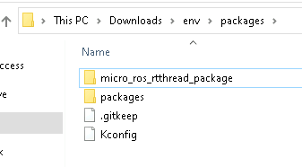

# micro-ROS for RT-Thread
This is a micro-ROS library for projects based on RT-Thread RTOS.

The build process for ROS 2 and micro-ROS is based on custom meta-build system tools and [CMake](https://cmake.org/).
SCons will handle the full build process, including dependencies, compilation and linkage.

- [micro-ROS for RT-Thread](#micro-ros-for-rt-thread)
  - [Supported boards](#supported-boards)
  - [Requirements for Windows](#requirements-for-windows)
  - [How to add to your project](#how-to-add-to-your-project)
    - [Build the library](#build-the-library)
  - [Library configuration](#library-configuration)
    - [ROS 2 distribution](#ros-2-distribution)
    - [Transport configuration](#transport-configuration)
    - [Extra packages](#extra-packages)
    - [Memory configuration](#memory-configuration)
  - [Using the micro-ROS Agent](#using-the-micro-ros-agent)
  - [Examples](#examples)

## Supported boards
Supported boards are:

| Board         | Platform  | Transports |
| ------------- | --------- | ---------- |
| `aurix_tc397` | `tricore` | `udp`      |


## Requirements for Windows

- Ready to use RT-Thread environment.
- Python 3.6 or higher installation in the system path.
- Python 3 pip installation in the system path.
- CMake 3.13 or higher installation in the system path.
- Git installation in the system path.

## How to add to your project

This package needs to be added manually to the RT-Thread env:

- Copy the `package\micro_ros_rtthread_package` folder from this repository inside of your main environment `env\packages` folder.

  

- Update the Kconfig files under the `env\packages\Kconfig` file with the added path:
  ```
  source "$PKGS_DIR/packages/Kconfig"
  source "$PKGS_DIR/micro_ros_rtthread_package/Kconfig"
  ```
- Copy the complete repository folder to your project `packages` subfolder.
- Now micro-ROS package can be activated through the `menuconfig` options:

  

Further documentation on how to add packages to RT-Thread environment can be found on [RT-Thread: Manage Software Package Index Source](https://github.com/RT-Thread/packages/blob/master/README_en.md#manage-software-package-index-source).

### Build the library

Once the package has been enabled, the library can be build with the following command:

```bash
# Build micro-ROS library
scons --build_microros
```

After the library is compiled for first time the build process will be skipped, to trigger a rebuild and included the latest changes:

```bash
# Clean library
scons --clean_microros

# Rebuild
scons --build_microros
```

## Library configuration
This section details the different library configuration options available to the user.
Note that a library rebuild is needed after `menuconfig` modifications or new micro-ROS packages are added.

### ROS 2 distribution

The target ROS 2 distribution can be configured with the menuconfig option `Distribution`, currently supported ROS2 distributions are:
  - `foxy` *(default value)*
  - `humble`

### Transport configuration

The transport can be configured with the provided user API for each type:
  - `UDP`:

    ```c
    char * agent_ip_address = "192.168.1.185";
    uint16_t agent_port = 8888;
    set_microros_net_transport(agent_ip_address, agent_port);
    ```

### Extra packages

Extra packages can be added to the build process by copying the package directories on the `micro-Landmark/builder/extra_packages` folder. Added packages will appear on the build process log:

```bash
Downloading micro-ROS library
         - Downloaded ...

Checking extra packages
         - Adding example_interfaces
```

This should be used for example when adding custom messages types or custom micro-ROS packages.

### Memory configuration

Memory footprint can be configured at the `Micro XRCE-DDS` middleware level:

| Parameter | Description | Default value |
|-----------|-------------|---------------|
| Nodes       | Maximum number of nodes       | 1 |
| Publishers  | Maximum number of publishers  | 1 |
| Subscribers | Maximum number of subscribers | 1 |
| Services    | Maximum number of services    | 0 |
| Clients     | Maximum number of clients     | 0 |

Further documentation on micro-ROS middleware configuration and memory footprint can be found on [micro-ROS client Memory Profiling](https://www.eprosima.com/index.php/resources-all/performance/micro-ros-client-memory-profiling) article.

## Using the micro-ROS Agent
It is possible to use a **micro-ROS Agent** just by using this docker command:

```bash
# UDPv4 micro-ROS Agent
docker run -it --rm -v /dev:/dev -v /dev/shm:/dev/shm --privileged --net=host microros/micro-ros-agent:$ROS_DISTRO udp4 --port 8888 -v6
```

## Examples

Simple publisher and subscriber examples are provided on the [examples](./examples) directory. This examples can be enabled with the `Include examples` menuconfig option.

The examples can be executed from the console with the Agent IP and port as arguments:
  ```bash
  # Publisher app
  msh > microros_pub 192.168.1.185 8888

  # Subscriber app
  msh > microros_sub 192.168.1.185 8888
  ```

Other examples and detailed documentation on micro-ROS can be found on:
- [micro-ROS Demos](https://github.com/micro-ROS/micro-ROS-demos/tree/humble/rclc) repository.
- [Vulcanexus micro-ROS API](https://docs.vulcanexus.org/en/latest/rst/tutorials/micro/user_api/user_api.html) documentation.

